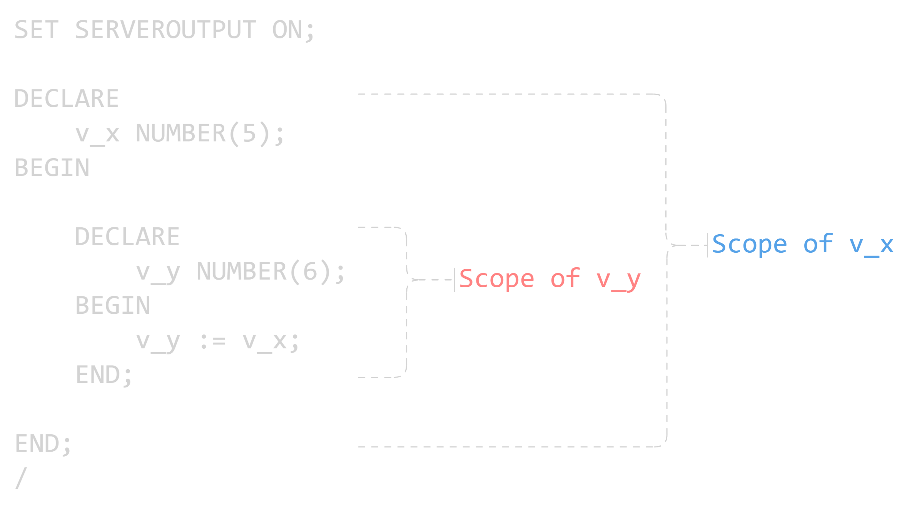

# Writing Executable Statements

## Lexical Units in a PL/SQL Block

Lexical units are the basic building blocks of any PL/SQL block.

They are sequences of characters classified into the following categories:

- Identifiers – Names given to variables, constants, procedures, etc.
  - Examples: `v_name`, `v_email`

- Delimiters – Symbols that have special meaning in PL/SQL
  - Examples: `+`, `:=`

- Literals – Fixed values used in statements
  - Examples: `'Tom'`, `1270`, `TRUE`

- Comments – Used to document code
  - Examples: `--`, `/* */`

### Delimiters

> Delimiters are simple or compound symbols that have special meaning in PL/SQL.

1. **Simple Symbols**

| Symbol | Meaning                       |
| :----: | ----------------------------- |
|  `+`   | Addition operator             |
|  `-`   | Subtraction/negation operator |
|  `*`   | Multiplication operator       |
|  `/`   | Division operator             |
|  `=`   | Equality operator             |
|  `@`   | Remote access indicator       |
|  `;`   | Statement terminator          |

2. **Compound Symbols**

| Symbol | Meaning                       |
| :----: | ----------------------------- |
|  `<>`  | Inequality operator           |
| `! =`  | Inequality operator           |
| `\|\|` | Concatenation operator        |
|  `--`  | Single-line comment indicator |
|  `/*`  | Beginning comment delimiter   |
|  `*/`  | Ending comment delimiter      |
|  `:=`  | Assignment operator           |

## SQL Functions in PL/SQL

- There are predefined functions available in PL/SQL such as
  - Single-row functions
  - Data type conversion functions
  - Character functions
- However, some SQL functions (such as group functions) can only be used inside SQL statements and not directly in procedural expressions.

> Example: Get length of a string

```sql
SET SERVEROUTPUT ON;
DECLARE
v_decs_size INTEGER(5);
v_prod_description VARCHAR2(30) := 'You can yse this product';

BEGIN
    v_decs_size := LENGTH(v_prod_description);
    dbms_output.put_line(v_decs_size);
END;
/
```

> Example: Get the number of months an employee worked

```sql
SET SERVEROUTPUT ON;
DECLARE
    v_hire_date DATE := '01-JAN-2021';
    v_tenure NUMBER;
BEGIN
    v_tenure := MONTHS_BETWEEN(CURRENT_DATE, v_hire_date);
    dbms_output.put_line('Months worked = ' || trunc(v_tenure,2));
END;
/
```

## Data Type Conversion

### Implicit Conversions

- Implicit conversions are automatically performed by the PL/SQL engine when mixed data types appear in an expression.

Example:

```sql
SET SERVEROUTPUT ON;
DECLARE
    v_salary NUMBER(6) := 6000;
    v_sal_bonus VARCHAR2(5) := '1000';
    v_sal_total v_salary%TYPE;
BEGIN
    v_sal_total := v_salary + v_sal_bonus;
    dbms_output.put_line('Total = Rs. ' || v_sal_total);
END;
/
```

When executing this block the engine automatically convert the `v_sal_bonus` into a `NUMBER(6)` data type in order to perform the operation of `v_sal_total := v_salary + v_sal_bonus`.

---

### Explicit Conversions

- Explicit conversions are performed manually using conversion functions provided by PL/SQL.
- Common conversion functions include:
  - `TO_DATE` - Char value to Date
  - `TO_NUMBER` - Char value to Number

```sql
SET SERVEROUTPUT ON;
DECLARE
    v_date_str VARCHAR(20) := '2025-01-25';
    v_num_str VARCHAR(20) := '7500';
    v_date DATE;
    v_num NUMBER;
BEGIN
    v_date := TO_DATE(v_date_str,'YYYY-MM-DD');
    v_num := TO_NUMBER(v_num_str);

    dbms_output.put_line('Date as date: ' || v_date);
    dbms_output.put_line('Number as number: ' || v_num);
END;
/
```

Output:

```txt
PL/SQL procedure successfully completed.

Date as date: 25-JAN-25
Number as number: 7500
```

## Nested Blocks and Variable Scope

- PL/SQL blocks can be nested inside other blocks.

- A nested block can appear anywhere an executable statement is allowed.

- Even the EXCEPTION section can contain nested blocks.

- Variables declared in an outer block are accessible to inner blocks (depending on scope rules).



## SQL Statements in PL/SQL

- Standard SQL statements can be written inside the executable section of a PL/SQL block.

### SELECT Statements in PL/SQL

- The `INTO` clause is required.
- Queries must return only one row.

```sql
SET SERVEROUTPUT ON;
DECLARE
    v_fname VARCHAR2(25);
BEGIN
    SELECT name INTO v_fname
    FROM employees WHERE employee_id = 178;
    dbms_output.put_line('First name is: ' || v_fname);
END;
/
```
